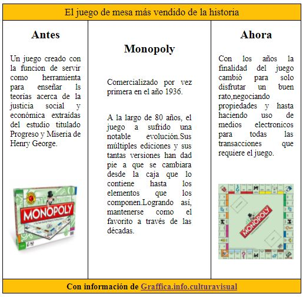

### CASO PRACTICO : TRIPTICO
***

 En el presente caso se nos solicito desarrollar una página web donde se visualice el diseñ de un triptico , con tema :Monopoly.

 ## Estructura

 1. Página web principal : index.html
 2. Hoja de estilos CSS : main.CSS
 3. 2 imágenes del tema indicado.

 ## Implementación del Diseño

 Para el dasarrollo del diseño del tríptico se aplicaron 5 elementos div que se posicionaron segun lo solicitado:
 *  1 encabezado : Frase
 *  3 columnas de cuerpo : Contenido
 *  1 Pie de página del triptico : Enlace de referencia
